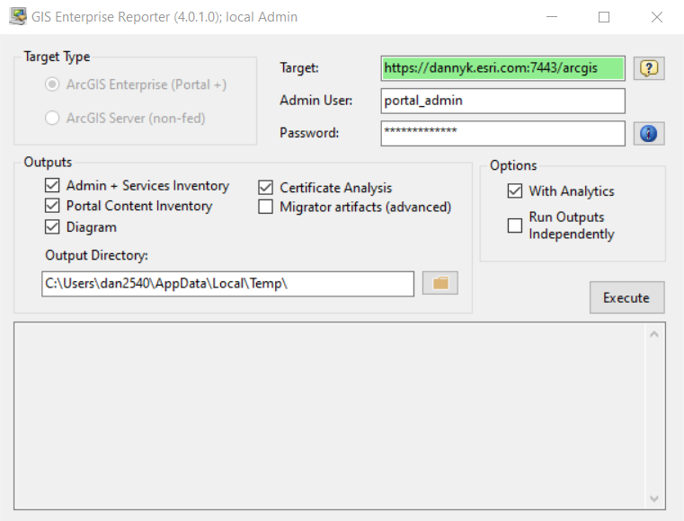
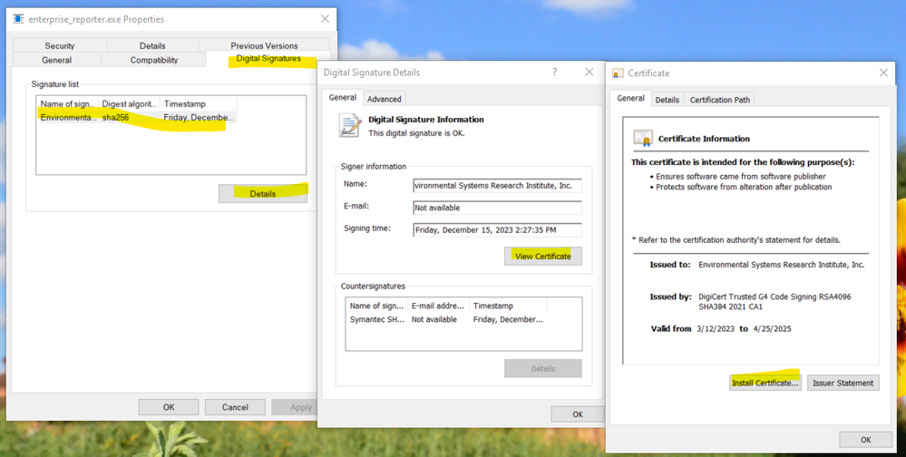

# Running GIS Enterprise Reporter, Tips & Tricks

The GIS Enterprise Reporter user interface is intended to have few options in the hopes that it is relatively straight-forward to execute. 

In principle, you give it a Portal for ArcGIS "Target", with an administrative credential for that Portal, tick some checkboxes, click "Execute", and wait for it to complete.  

There are some things that benefit from explanation.  This article will offer information on the following topics:

1. Where should I run this application?
2. How should I run this application?
3. What value should I put in the "Target"?
4. What are some common problems (and solutions)?
5. What do the options (checkboxes) mean?

## Where Should This Application Be Run?

GIS Enterprise Reporter can, in principle, be run from anywhere that it can communicate to your Portal for ArcGIS. 

However, there are better and worse locations.  The application works by asking Portal about itself and its federated ArcGIS Servers.  This means that Reporter wants to communicate with the federated Servers in the same way that Portal does.  Various aspects of your configuration and network rules may mean that communicating from your personal computer with Server cannot happen through the same means as Portal. 

How would you know?  Not easily.  So, how could you protect yourself against this possibility?  The easiest way to do that is to run the application from within your server network.  For example, you could run it on the machine on which Portal runs.

## How Should this Application Be Run?

It is not necessary to run Reporter as a local machine administrator.  However, doing so will usually allow it to gather more information for you.  And, it may help you to overcome some potential execution challenges.

If you wish to run the application as a local machine administrator (assuming you are a member of that local machine Administrators group), right click on the enterprise_reporter.exe executable and select "Run as administrator" from the context menu.

You may or may not receive a message from your operating system or security software that discourages you from running this application. 

This application is digitally signed by Esri with a chain of authority from a public Certificate Authority.  So, it is unlikely that the message will mention certificate trust.  But, if it does, you may wish to explore importing the trust chain into your trusted repository.  To initiate the "installation" workflow for the certificate, follow the steps show in the screen capture below :

Selecting "Current User" and "Automatically select the certificate store based on the type of certificate" are the appropriate options on the "Install Certificate" wizard panels.  This may relieve you of the warning.

Or, if you are a machine administrator, you may have options to execute the application.  To do so, you may have to click buttons that say things like "More Options", "Run Anyway", etc. ... depending on what is issuing the warning and your rights.  For example:

These technical methods are not offered to circumvent the guidance of your organization with respect to third party executables.  Please use the privileges granted to you by your organization responsibly.  

The Reporter application only runs on Windows.  However, you can use it to report on an ArcGIS Enterprise on Windows or Linux.  In the event that your Enterprise is on Linux, running Reporter as a local machine administrator does not produce any additional output information in the report documents.  The only reason to run Reporter as local machine administrator in that case is to give you more options in response to an unsigned application warning if you receive one.

## What Is the Right Value for "Target"?

There are three basic options:

 1. The FQDN ('portalmachine.domain.com') of the machine
 2. The 7443 endpoint for Portal ('https://portalmachine.domain.com:7443/')
 3. The WebContextUrl for Portal ('https://proxy.domain.com/portalcontext')

The first two options amount to the same thing.  If you enter the FQDN of your Portal machine (either machine in the case of a two-machine "high-availability" Portal), Reporter will fix-it up into option #2 for you.  In addition to being relatively straight-forwards, this is usually the best option for "Target" value as well.  So, it is recommended that you use the FQDN (fully-qualified domain name) of a Portal machine (the machine's "A RECORD").

Of course, this implies that your network will allow you to get to Portal's 7443 port from where you are running Reporter.  This is why the first tip encourages you to run Reporter on your server network because it is on that network that this network pathway will be allowed.

The third option is to provide the WebContextUrl (or Web Adaptor-style address) as the target.  This generally works.  However, Reporter only knows about "Portal tier authentication".  So, if this pathway (WebContextUrl) involves "web tier authentication" or requires SAML, OIDC, etc., Reporter will not be able to authenticate.  

As you might be able to infer, the values for "Admin user" and "password" must be a user that has administrative rights on your Portal and is authenticated at the Portal tier.  This certainly includes Portal's "Initial Administrator Account".  But, you can also use any other account that is a Portal administrator and can get a token directly from Portal's 7443 REST endpoints.

## Common Problems and Solutions

The application comes with a Microsoft Word document which includes a section on Troubleshooting.  If you are having a problem, you should consult that first.  

The most common problems are usually having to do with access to the token REST endpoint.  Those problems are best avoided by running the application from the server network and using the machine FQDN as the target address.  The message in the application will look like this:

Exception while acquiring token. Please use a browser to check the url: `https://<f.q.d.n>:7443/arcgis/sharing/rest/generateToken` and credentials.

As you can see, it asks you to validate that the URL target to get a token is reachable from the machine on which you are running Reporter.  If you can get to that endpoint, then try generating a token.  If you can do both of those things, Reporter will run.

## What Are the Checkbox Options?

At a high-level, the checkboxes have the following implications:

`Admin + Services Inventory`: This touches all of the REST endpoints in the Admin APIs for your Portal and your federated Servers.  It records all of the configuration information of your Enterprise, lists all of its services and their properties, etc.  The information is quite broad and deep. This makes it very valuable.  But, it can be challenge to get a high-level picture.  The specific contents of this file output will be explored in future articles.

`Diagram`: The diagram provides a high-level picture of the logical structure of your Enterprise.  This is an example from a very simple (development environment) system:

`Certificate Analysis`: Reporter does its best to connect to each of the HTTPS endpoints in your Enterprise (i.e. Reverse proxies, Web Adaptors, Portal's on 7443, Server's on 6443, etc.), discovering the certificates and reporting on various facts like certificate subjects, expirations, and trust chains.  There are several sheets in the Excel, each sheet corresponding to a different HTTPS access pathway.  For example:

`Portal Content Inventory`:  This output is created by stepping through Portal's Sharing API.  It lists all of the content in the Portal, along with its "metadata" (content type, owner, etc.).  And, it can provide lists of users, groups, etc.  This output will also be explored in more detail in future articles.

`Migrator Artifacts (advanced)`:  This is, as the name implies, an advanced option.  Most users will never need this.  This option does two things.  The first is that it writes out the json from the REST endpoints into a subdirectory.  So, if you are someone that likes working with json, you can find it all there.  Second, when it finds sufficient information in Portal to export out "service definitions", it will do so.  This can be helpful if you wish to re-publish services.  If you published your service through ArcGIS Pro, it was very likely to story the service definitions there such that Reporter can access them.  

## Conclusion

Hopefully, this article has provided a useful orientation to how to run the GIS Enterprise Reporter tool.  As mentioned, it comes with a Microsoft Word document that provides additional information.  Should you run into challenges or have questions that are not clearly addressed, please be in touch through the contact information in that document.  You may post comments questions here also, if you wish.

Prior Series Article: Introducing the GIS Enterprise Reporter

Next Series Article: GIS Enterprise Reporter: Making the Most of Services Outputs