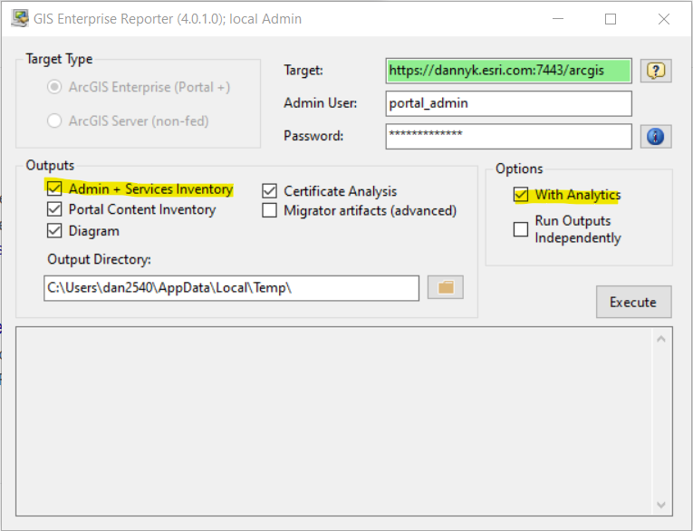
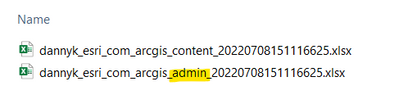
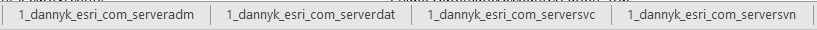
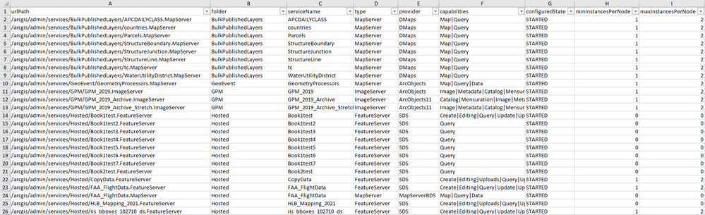
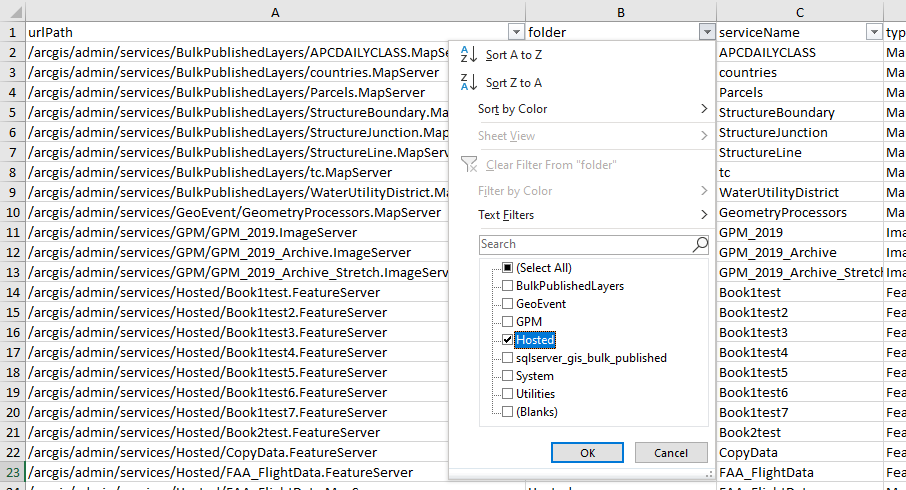
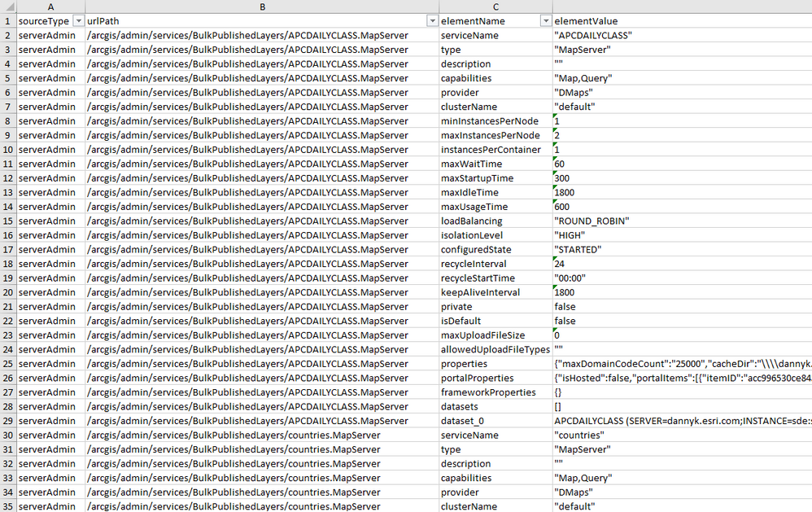
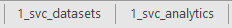
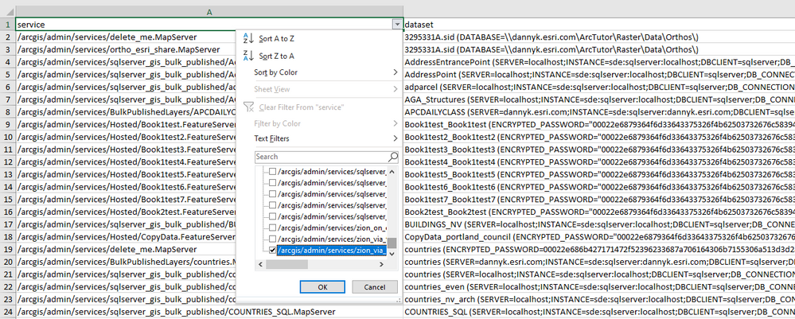
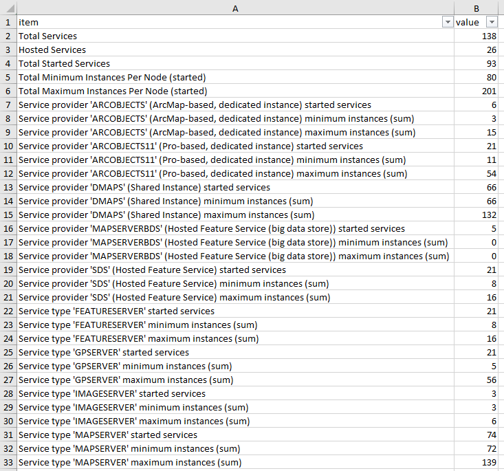

# Making the Most of Services Outputs

## Introduction

GIS Enterprise Reporter provides a lot of information about the content and configuration of an ArcGIS Enterprise.  Among the outputs available is an "admin" Excel workbook.  That workbook's sheets contain information available from the Admin API's of each server role in the ArcGIS Enterprise (Portal and all of the federated ArcGIS Server Sites).  For each federated ArcGIS Server Site, there are several sheets that describe aspects of the services inventory.

This is the third article in the GIS Enterprise Reporter series.  If you are not familiar with the series, this is the first article: Introducing the GIS Enterprise Reporter. 

## Generating the "Admin" Excel

The default execution parameters of GIS Enterprise Reporter will generate the "Admin" Excel output.  The "Admin + Services Inventory" checkbox creates and populates the workbook from the Admin API.  The "With Analytics" checkbox will calculate a variety of aggregate statistics and other information of interest from the raw outputs, placing them in additional sheets in the same Excel workbook.

The workbook will be placed in the output directory and will bear a name indicating the name of the ArcGIS Enterprise followed by "_admin_" and a timestamp as shown here:

## Understanding the Services Content

Within the Admin Excel workbook, each federated ArcGIS Server site will have a series of tabs that begins with a number, the name of the site, and a suffix. 

### Finding the Basics

An example of the main sheets for a federated Site appears below:

Each federated Site is given a number by GIS Enterprise Reporter.  In this example, we are looking at site number "1".  And, the site name is dannyk_esri_com (the DNS name by which the Site is known). 

The suffixes have the following meanings:

    * `serveradm`: Information extracted from the Admin API about how the Site is configured.
    * `serverdat`: If the site is a Hosting Server Site, this sheet will provide a little bit of additional information about the Data Store.
    * `serversvc`: An exhaustive list of all of the properties of all of the services in the ArcGIS Server Site.  If you need to know any particular fact about a service that ArcGIS Server knows, it can be found here.
    * `serversvn`: A "normalized" listing of the most commonly used properties of the services in the ArcGIS Server Site.  The sheet is more useful to understand the services inventory over-all.

### The "Normalized" Services Listing

The "normalized" services listing is a good place to start.  Each line is a service and some essential pieces of information about it.

The first row has filters that can be used to focus on information of particular interest.

### The Detail in "serversvc"

The "serversvc" sheet has one line per service property.  This makes it less convenient for understanding the big picture.  But, if you want to know the recycleStartTime, the portalProperties, or the referenced datasets, they are available here.

### Exploring the Analytics

If you selected "With Analytics" there will be two additional sheets for each federated ArcGIS Server Site.  Their names include only the site number assigned by GIS Enterprise Reporter and a suffix indicating their content.

#### svc_datasets

The svc_datasets sheet is a listing of all of the datasets referenced by the dedicated instance services in the Site (Hosted Services and Shared Instance services do not include this information in the ArcGIS Server Admin API).  As with the other sheets, it is filterable if you wish to focus on particular services or datasets.

The dataset information is formatted as it is in ArcGIS Server: datasetname followed by the workspace from where it comes.

#### svc_analytics

"svc_analytics" contains a variety of calculated statistics about the services (and the service instances) in the Site.

The first few statistics are about the services over-all.  However, most of the statistics are focused on only those services that are running.

The "Total Minimum Instances Per Node (started)" is of interest because this is the number of instances that exist as soon as ArcGIS Server starts.  The "maximum" statistic is the upper limit.  However, it is almost never the case that all services have their maximum instantiation at the same time.

Statistics are presented by "provider" (indicating something about how the service was published and how it runs) and "type" (indicating something about what it can do).  As noted, these statistics focus on the services that are running, and their min/max instancing.

## Conclusion

Hopefully, these Excel worksheets provide information that help you better understand and manage the services in your ArcGIS Enterprise.  If you have ideas for improved information, please share it with me: Danny Krouk (dkrouk@esri.com).

The next article in this series explores how to compare GIS Enterprise Reporter outputs to gain insight into meaningful differences between systems: [Comparing ArcGIS Enterprise Systems](https://community.esri.com/t5/implementing-arcgis-blog/comparing-arcgis-enterprise-systems/ba-p/1206865).